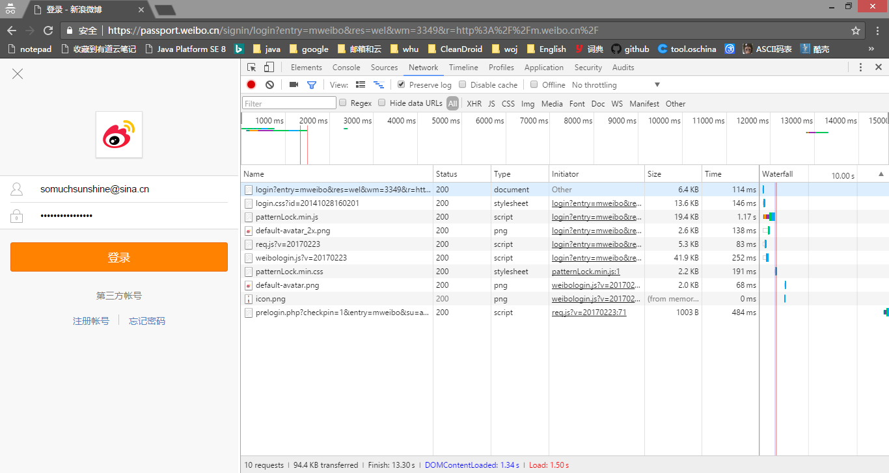

此脚本用于爬取指定用户的微博，参考了http://python.jobbole.com/84349/的方法。

## 什么是 user_id
比如在链接 http://m.weibo.com/u/3168799531 中, 3168799531就是 user_id

## 如何获取cookie
以chrome浏览器为例，访问 m.weibo.com，同时打开开发者工具（快捷键：F12），选择Network，勾选 Preserce log。登录微博，开发者工具开始抓取网络日志，找到 m.weibo.cn->Headers->Cookie，将其复制到代码中。

## 如何运行 HOW TO RUN
python3 weiboSpider.py user_id

